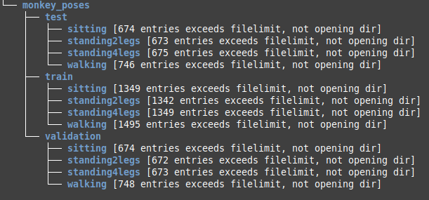
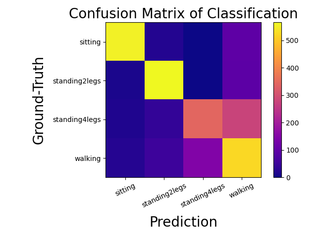

# Monkey Pose Classification

## Installation
* Clone this repo
```
conda env create -f environment.yml
conda activate mpc
cd ${monkey-pose-classification}
```


## Use
Whole videos can be used as input. Video path can be given through --video_path <video.mp4> and --bb_path <output.txt> to the BoundingBox labels given through the MC-FairMOT. The output will then be the video annotated with the monkey bounding box, including a pose label, and the score for every pose in the top right corner.

### Used data
The dataset used for training and validation of this model was created by me based on data made available by the DPZ-Goettingen.

Dataset is comprised of 11,070 images.
Of these Images 5,535 are in train, 2,768 in test and 2,767 in validation.
They where taken from seven different camera perspectives and two different monkeys.
Per video 300 frames per pose where sampled and for each pose split into 1/2 train, 1/4 test and 1/4 validation.



## Classification performance


## Inspiration and Contribution (Acknowledgement)
- The folder and file structure of this repository is strongly inspired by the [**FairMOT repository**](https://github.com/ifzhang/FairMOT)
- Additionally some of their helper files where taken as is and some with less subtle alteration


- The model used for the task at hand is a resnet50, as can be imported through PyTorch